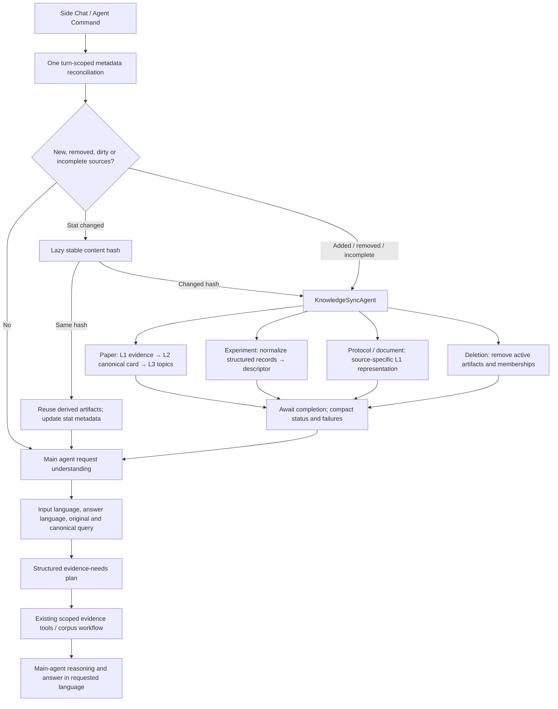

# Pre-request knowledge synchronization

Side Chat and Agent Command share `ProjectContextService.buildContext()`. Its first operation is `AgentRequestPipeline.preflight()`. This replaces Side Chat's separate catalog refresh and adds the same gate to Agent Command. The existing FC main-agent tool loop and corpus workflow follow the gate.



## Source authority and reconciliation

L0 files remain authoritative. Experiment numbers remain in canonical structured records with raw cell provenance. The worker never rewrites originals or translates source material.

`SourceRegistry.reconcile()` flattens the existing filesystem tree and compares relative path, kind, size, modification timestamp, filesystem identity and registry status. Electron supplies nanosecond timestamps as decimal strings and `device:inode` identity from native stat. The browser adapter retains its available millisecond timestamps. File identity reconnects a rename only when the old path has disappeared; distinct hard links remain distinct sources.

The reconciliation returns the legacy change arrays plus:

```json
{"added":["source-37"],"removed":["source-12"],"possiblyModified":["source-8"],"unchanged":34}
```

It reads no PDF/workbook bytes and makes no hash, parser, QMD or model call. An unchanged registry/catalog is retained in memory without rewriting it. Existing pending work from folder opening, a previous partial failure or an interrupted run is also considered; an unchanged *fully synchronized* project does not start a worker.

Only stat-dirty sources receive lazy stable-hash verification. The existing harness content hash is authoritative. A timestamp-only change retains L1/L2/L3 and avoids index/card work. A same-content rename refreshes source-path provenance without regenerating a card. A stat-identical in-place replacement cannot be detected by a metadata-only scan; explicit verification or a later metadata change is needed. This is the existing deterministic filesystem limitation.

## Worker and main-agent boundary

`KnowledgeSyncAgent` is a bounded maintenance orchestrator, not another conversational agent. Its input is exactly workspace ID, `{added, removed, modified}` source IDs and the fixed synchronization task. Its frozen capability allowlist contains source inspection/readiness, card generation, topic updates, experiment normalization, document preparation, derived removal, readiness persistence and metadata refresh. There is no shell, arbitrary code execution, recommendation writer, conversation or user question.

Paper synchronization uses the existing preparation service in separate stages:

1. Stable snapshot and hash.
2. Local PDF extraction, page/chunk JSON, page-preserving L1 Markdown and incremental lexical QMD update. No LLM or embeddings are required.
3. Existing canonical structured Paper Card generation/validation and its Markdown mirror. Source ID/hash, schema, extractor, model signature and prompt contract remain part of cache identity. All model/native-PDF/text fallback calls use Electron → authenticated Alibaba FC → Requesty.
4. Deterministic topic membership from card topics, entities and clear engineering-method labels. Membership stores source versions. Affected summaries and shallow ancestors become stale; stale summaries are omitted from active topic Markdown. No topic-summary regeneration or hierarchy rebuild occurs. This implementation needs no L3 classification LLM.

Combined-text cards use Requesty's strict `json_schema` format when configured, or its documented `json_object` fallback with the complete canonical schema in the prompt. Both modes retain the same validation and source identity requirements. Missing strict-schema support no longer makes L2 unavailable. Decoding mode and the revised combined-text prompt are included in the configuration signature. Parsed caches are stored in `.biodesign/sources/artifacts`; `.biodesign/literature/cache` is obsolete and is no longer created. `.biodesign/literature/summaries` remains the canonical card directory.

Registry `knowledgeSync` records version, source hash/stat identity, completed stages, status and compact failure. `L1_READY`, `L2_READY`, `SYNC_READY`, `partial` and `removed` distinguish progress from completion. A failed L2 card does not erase usable L1 evidence. Valid cards remain reusable when L3 fails. Each retry validates existing artifact identities before reuse.

Two Paper Card workers can generate cards concurrently. Their native, combined-text, excerpt, and synthesis requests share a two-slot client pool, including retries. A provider throttle reduces the pool to one slot for the current model configuration; already-started calls may finish, and later calls share the existing cooldown. Confirmed provider input-token rate quotas activate the existing excerpt/synthesis fallback for long combined-text requests. Queued full-paper requests recheck the learned quota before sending. The client learns a conservative character budget for the current model configuration; this is separate from the model's context window. Excerpts retain the full bounded source, and oversized collections of excerpt summaries are reduced in bounded groups before final synthesis. Other provider failures and invalid card output do not activate this fallback. Debug logs identify each `PaperCardAgent` worker, active workers, queued calls, and the effective request concurrency.

FC returns upstream throttling as `429 / ProviderRateLimited` with `providerStatus`, `retryAfterMs`, `quotaMetric`, `inputTokenLimit`, and `rateLimitRetryable`. It defers text-endpoint cooldowns to Electron instead of immediately retrying inside the function. Electron honors the longest retry hint plus a one-second margin, shares the cooldown across queued calls, supports cancellation, and attempts at most one automatic transport retry. Daily/zero quotas and cooldowns longer than two minutes remain explicit failures. Compatibility parsing recognizes the older FC `502 / LlmHttpError` wrapper, so the Mac fix can recover against that deployed backend as well. Debug logs show the actual provider status, budget, fallback route, and cooldown; raw provider response bodies are excluded.

The main agent receives the original request/conversation, language metadata, evidence plan, updated compact project state, and the compact report below. Extraction chunks, complete cards, maintenance prompts and tool transcripts are not part of the report. FC whitelists its fields before constructing agent context.

```json
{
  "status":"partial",
  "added":{"papers":2,"experiments":1,"documents":0},
  "removed":{"papers":1,"experiments":0,"documents":0},
  "updated":{"l1Evidence":3,"paperCards":2,"topicMemberships":6,"experimentSources":1,"documents":0},
  "failures":[{"sourceId":"source-34","stage":"L2","code":"CARD_FAILED","retryable":true}],
  "sources":[{"sourceId":"source-34","status":"partial","contentHash":"sha256:..."}]
}
```

Counts describe completed work. One malformed source does not stop unrelated sources. The main agent is explicitly told not to claim complete coverage with a failed/incomplete required source; it can use existing bounded source-tool fallback or report the limitation. No partial report fabricates SYNC_READY.

## Experiment and other source handlers

| Registry kind | Handler |
| --- | --- |
| `paper` | PDFs under `literature/`; L1 → L2 → L3 as above |
| `experiment` | Supported CSV/TSV/XLS/XLSX/TXT under `experiments/`; existing schema mapping, structured records and searchable descriptor; no Paper Cards |
| `protocol` | Existing `protocols/` sources; supported text formats or local PDF extraction into project-memory L1 |
| `other` | Existing PDFs outside literature; local extraction into project-memory L1, no Paper Card |
| `document` | Non-hidden project MD/TXT/HTML/JSON; original-language searchable L1 |

Unsupported binary protocol formats are reported as incomplete rather than coerced into a paper representation. `.biodesign` derived files and ignored OS artifacts are excluded from source discovery.

Experiment normalization reuses deterministic aliases/units first, preserves sheet names, original headers, cells and units, and retains source/hash/cell provenance. Unresolved mappings use the existing bounded FC schema mapper under the default policy. Confirmed mappings remain cached in the existing project schema-mapping artifact. Numeric filters, aggregation and ranking use `ExperimentTools.executeSemanticQuery()` over structured records; descriptor prose is only a discovery aid.

## Deletion and invalidation

A missing source loses active registry membership immediately; its tombstone/hash may retain historical identity. The maintenance worker removes parsed/normalized active artifacts, canonical card files and cache associations, evidence/card/experiment/document Markdown, topic memberships and active source selections. Derived memory records with source provenance become stale and leave the active memory index. Current source metadata is refreshed.

Affected corpus journals and synthesis mirrors are marked stale using the existing workflow lifecycle; their historical snapshots/results remain available as history. Structured experiment records disappear from active queries because the registry association and its active artifact are removed. Historical result handles are not rewritten.

Deletion indexes are updated deterministically. If a QMD update fails, the affected collection is suppressed from search until a successful update; cleanup remains pending for retry. A source discovered missing during preparation is also cleaned before that request proceeds, without rescanning the directory. Missing or dirty source hits are filtered at the host boundary.

## Concurrency and turn scope

Both surfaces share one pipeline instance per source system. Concurrent requests join its in-flight reconciliation/synchronization promise and await the same job. The existing job manager records `knowledge-sync`; existing per-source preparation locks deduplicate individual stages. A two-source pool bounds preparation/card work. Topic mutations are serialized, registry writes are queued, and the existing QMD project queue owns SQLite updates.

Turn IDs reuse a reconciliation promise, including subsequent card/catalog projections. No internal card call rescans the raw directory during that turn. Agent Command uses a new request ID each invocation. An explicit host filesystem mutation can invalidate the turn through `invalidateTurn()`; maintenance artifact writes do not require another scan.

Individual request cancellation stops that consumer from answering without cancelling shared work. The project-lifetime abort signal cancels preparation on project change. Registry writes reject a changed workspace identity.

## Language and evidence planning

The current input establishes `inputLanguage`. Explicit answer-language instructions take precedence; otherwise answers follow the input language. The handoff keeps `originalQuery`, `canonicalQueryEn`, `inputLanguage` and `answerLanguage`. App UI language no longer inserts a contradictory answer-language instruction.

The existing shared semantic interpreter runs **after** synchronization. When local interpretation is insufficient, one bounded authenticated FC semantic call combines goal interpretation, English working-query formulation, entities, operations and constraints. The semantic `goal` is the canonical English query in that response. Local interpretation retains exact identifiers and derives canonical concepts; failure retains the original query and explicitly incomplete local semantics. Raw evidence is never translated. Existing explicit persistent answer-language preferences still apply.

`planEvidenceNeeds()` composes registered semantic objects/operations into advisory evidence needs. FC reconstructs this plan rather than trusting client-supplied tool permissions. The same main conversational LLM is instructed to assess/refine it, select tools, reason and answer; no second conversation/planner agent is created.

| Request | Evidence |
| --- | --- |
| Exact Km/temperature in P17 | L1 page evidence and direct tools |
| Whole-paper summary | Valid L2 card for orientation plus bounded L1 |
| Strategies across literature | L3/L2 routing plus L1 scientific evidence |
| Last review | Historical L4 synthesis with coverage/status |
| Highest measured titer | Structured experiment records and deterministic ranking |
| Experiment/literature comparison | Structured experiment results plus L1 literature |
| Figure/layout question | Native PDF if required |
| General non-project question | No project evidence |

Light/Medium/High storage and UI compatibility remain. The shared request pipeline currently resolves all three to the existing **Medium** local-first policy: one semantic call when needed, lexical retrieval first, evidence-driven escalation. Han characters no longer force Deep in Light or Medium. Language interpretation and retrieval depth are separate. This is one default policy, not a redesign of cost tiers.

The corpus `SNAPSHOT → PREPARE → MAP → GROUP → REDUCE → VERIFY → ANSWER` implementation remains intact. Preflight precedes it. Valid cards/maps retain their reuse priority, and uncovered paper workers still share one corpus planner per question/workflow. Sync workers and question-specific corpus mappers remain separate.

## Permissions, activity and telemetry

Synchronization uses INTERNAL_STATE capabilities on both surfaces. Side Chat still cannot commit Current Recommendation; Agent Command's existing result-producing authorization is unchanged. Credentials, model selection and provider transport remain behind FC. No Requesty client or credentials were added to Electron.

Existing activity components show checking files, source changes, evidence, cards, topics, experiments, ready or partial status. Only safe stage labels/counts are shown.

`request_preflight` records reconciliation duration, changed count, sync duration, L1 count/time, L2 logical model request count/time and generation count, L3 model count/time (zero for deterministic assignment), topic update time, experiment count/time, schema-mapper count where available, hash count and main-agent gate start. Existing provider diagnostics retain transport retries separately. No raw scientific content or private prompts are added to this telemetry.

The **Debug Console** button is available on the login, workspace selection, and workbench screens, including packaged Mac builds. It opens a non-modal live log with **Copy logs**, **Clear**, and **Close** controls. The latest 1,000 events remain in memory for the current app session and are mirrored to the renderer console with a `[BioDesign]` prefix. Logs are not written to the project or sent to FC.

The console records shared preflight reconciliation; `sync-agent.started`, `.skipped`, `.completed`, or `.partial`; each source's L1 evidence, L2 Paper Card, and L3 topic stages; cache reuse; job and corpus mapper activity; semantic interpretation and retrieval; and main-agent requests. Backend calls include endpoint, role, paper/turn identifiers, HTTP status, retry attempts, and elapsed milliseconds. Pending operations report `.waiting` every 15 seconds. `paper-card.configuration` identifies the advertised text/PDF routes and structured-output mode, so an old backend gate is visible immediately. Failures include their code and failing source/layer.

Remote main-agent capabilities are logged as `backend.capability-reported` when the HTTP response arrives; the backend does not stream its internal tool loop. Local worker start events represent actual worker execution. The logger accepts only operational metadata, excluding credentials, request/response bodies, question text, and scientific source contents. No FC deployment is required for the console itself.

## Validation and benchmark

`alibaba-fc/test/preflight-knowledge-sync.test.js` exercises scenarios A–D, timestamp-only reuse, changed hashes, worker/context isolation, both surfaces, partial L1/L2/L3 failures, concurrent cancellation/retry, deletion during preparation, QMD failure suppression, structured Chinese XLSX ranking and language handoff to the main loop. Provider outputs are controlled test fixtures; these tests do not claim live provider behavior.

Run:

```sh
npm test
npm run check
npm --prefix alibaba-fc run check
node scripts/benchmark-preflight-sync.mjs
```

For the benchmark on Electron's bundled Node runtime on macOS:

```sh
ELECTRON_RUN_AS_NODE=1 node_modules/electron/dist/Electron.app/Contents/MacOS/Electron scripts/benchmark-preflight-sync.mjs
```

The checked-in [benchmark sample](benchmarks/preflight-knowledge-sync.json) uses real `ProjectFilesystem` tree/stat and the production registry/gate on 150 synchronized synthetic source fixtures, ten unchanged requests, Electron Node 24.18.1 on macOS arm64. Median reconciliation: **4.164 ms**; p95 **5.022 ms**. Median time until main-agent gate: **4.193 ms**; p95 **5.057 ms**. All measured turns performed **zero raw reads, hashes, card calls and QMD updates**. Setup uses controlled parser/provider/QMD adapters. These timings exclude semantic/model latency and do not claim live PDF/provider benchmarks.
