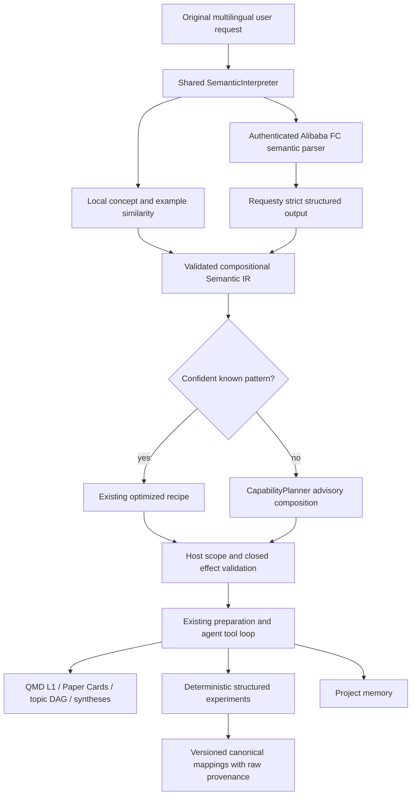

# Semantic interpretation above the existing knowledge layers

BioDesign Copilot interprets requests before selecting context for the existing workspace agent. This layer canonicalizes request metadata and experiment schemas. Original documents, workbook cells, evidence handles, and source authority remain unchanged. Read [QMD_KNOWLEDGE_ARCHITECTURE.md](QMD_KNOWLEDGE_ARCHITECTURE.md) for the underlying L0–L4 architecture.

## Contract and ownership

`shared/semantic-intent.js` is a UMD module used by the renderer and FC. Its `SemanticInterpreter.interpret` accepts a query, compact conversation context, active scope, the host-selected profile, a compact project semantic registry, and an optional FC callback. It returns `{ir, telemetry}`. Neither semantic parsing nor an agent response can change the saved profile.

Semantic IR v1 contains:

| Field | Meaning |
| --- | --- |
| `inputLanguage`, `answerLanguage` | Current query language and explicit response preference |
| `matchedPattern`, `patternConfidence` | Optional known shortcut; `null` is a normal result |
| `goal` | Open-ended requested goal; not executable code |
| `operations`, `objects` | Composable bounded operation primitives and extensible object identifiers |
| `entities` | Canonical ID, original mention, and entity type |
| `metrics` | Canonical field and maximize/minimize/target direction; unresolved field may be null |
| `scope` | Papers and experiments: null, current project, or explicit IDs |
| `filters`, `constraints` | Typed operators, values, units, and bounded descriptions |
| `comparisonVariables` | Conditions such as temperature |
| `requestedOutput` | Extensible output type and optional result `limit` |
| `capabilityHints`, `unresolvedSlots` | Registered capability suggestions and explicitly missing criteria |

A current query such as “Which one is best?” does not establish a scientific metric. A saved explicit primary metric may fill the slot; an inferred project product does not automatically become the primary metric. Empty selected-ID arrays mean no selection, while nonempty selected IDs remain hard boundaries. The FC result cannot widen them.

The strict JSON Schema forbids extra properties at every object level. The host rejects invalid operations, malformed entities, unknown capabilities, additional effect/profile/code fields, rewritten protected identifiers, and weak or incompatible named-pattern claims. No IR field is evaluated as code or shell input.

## Pattern library and local matching

`SEMANTIC_PATTERNS` contains versioned English and Chinese examples, default operations, object coverage, output metadata, and required capabilities. Patterns include corpus synthesis, paper questions/search/comparison, experiment search/lookup/ranking/comparison/trends/statistics, cross-source comparison, memory, project status, and recommendation explanation/update. Additional languages fit the same examples map.

The fast path maps multilingual aliases into a shared sparse concept representation and compares it with the static example representations using cosine similarity. It also extracts exact identifiers, canonical field aliases, scope, and numeric slots. It does not initialize an embedding model or add another embedding stack: production QMD currently runs lexical retrieval unless optional vectors are explicitly enabled. This implementation is local concept/lexical similarity, not a claim of general multilingual neural embedding coverage.

The calibrated defaults are a known-match threshold of 0.86, uncertain threshold of 0.64, and winner margin of 0.08. A pattern also has to cover the requested objects and operations. Similarity scores are matching scores, not calibrated probabilities. An incompatible composition remains open even if it shares vocabulary with a common pattern. The benchmark fixtures and report exercise both paraphrase acceptance and open-set false positives.

Known-pattern caching includes the normalized query with protected-ID case retained, compact conversation and active scope, profile, semantic schema version, pattern library version, and project registry version/content. It is a bounded in-memory optimization, not a second lifecycle database. Context-dependent results are never keyed only by query text. Invalid/failed remote interpretations fall back locally and are not cached as successful remote interpretations.

## Profiles and FC boundary

| Profile | Semantic interpretation | Retrieval after interpretation |
| --- | --- | --- |
| Light | Local only; partial/open IR is valid; zero dedicated router calls | Existing Light retrieval rules remain |
| Medium | Local first; at most one parser request for uncertainty, missing slots, multiple domains, or complexity | Existing Fast-first escalation rules remain |
| High | Proactively uses the same parser for relevant complex compositions; simple known requests can remain local | Existing High Deep planning/reranking and material paper/PDF policies remain |

`POST /api/semantic/interpret` accepts only the bounded compact contract. It combines goal interpretation, language handling, entity extraction, and slot extraction in one call. The parser sees at most four short conversation entries, bounded source IDs, a compact topic/objective, a primary metric, and limited ontology labels/aliases. It receives no Paper Cards, full memory, experiment tables, or source documents.

The endpoint uses the existing authenticated FC boundary and `REQUESTY_SEMANTIC_PARSER_MODEL` with the existing model fallback. Structured output requires `json_schema`; semantic parsing has no JSON-object downgrade, translation subcall, or repair subcall. Existing provider transport retries are distinct from this single logical semantic request. The renderer does not retry the semantic endpoint. A failure preserves the local IR.

Production context routing consumes semantic objects and host-resolved scope, without a second context-router call. The older context-router helper remains available for compatibility. Search planning/reranking remain separate retrieval operations. No whole document is translated to normalize a request.

## Capabilities and effects

`CAPABILITY_REGISTRY` describes all current agent tools and the host preparation recipes using object support, operation support, tool name, effect, and host-only status. `planCapabilities` covers requested object/operation pairs using registered tools. Plans are advisory: they contain no code or tool arguments, and the existing agent loop selects and validates concrete calls.

The existing closed effect strings remain authoritative:

- `informational`
- `internal_state`
- `result_producing`
- `destructive_source`
- `external_side_effect`

Side Chat permits informational and internal-state operations. Agent Command also permits its existing result-producing operations. Understanding “update the recommendation” never authorizes Side Chat to commit one. “Why is A163V recommended?” takes the explanatory path. Both surfaces use the same interpreter and registry; surface authorization is applied independently.

The corpus pattern, or an explicit corpus subrecipe within an open composition, invokes the existing `SNAPSHOT → PREPARE → MAP → GROUP → REDUCE → VERIFY → ANSWER` workflow. It preserves corpus coverage, valid Paper Card reuse, resume/invalidation rules, and the one-shared-planner-per-workflow behavior.

For a novel experiment/literature composition, the host can compute the ranking before literature preparation, bind resulting mutation IDs into existing scoped searches, and pass deterministic results and unverified constraints into the same agent loop. Missing evidence is reported rather than manufactured.

## Experiment normalization and corrections

`shared/experiment-semantics.js` supplies the canonical field/alias registry, localized labels, entity aliases, unit normalization, and schema-mapping service. Semantic interpretation reuses its field and scientific aliases. Fields include temperature, pH, culture time, hydroxyectoine titer/yield, generic titer/yield/productivity, enzyme/specific/relative activity, OD600, mutation, strain, protein, gene, and experiment ID.

Lazy experiment preparation continues to populate the existing source artifact store. Canonical numeric/string values, units, and per-cell provenance are derived alongside the original `raw` map and original sheet rows. Duplicate headers retain positional cell provenance rather than silently overwriting canonical truth.

Mapping uses canonical IDs and exact aliases first, then unit/context evidence and compatible cached project mappings. Ambiguous headers remain unresolved with candidate fields:

| Raw header | Local interpretation |
| --- | --- |
| `Temperature`, `Temp.`, `温度（℃）` | `temperature` |
| `Hydroxyectoine Titer (g/L)`, `羟基依克多因产量（g/L）` | `hydroxyectoine_titer` |
| `Culture Time (h)`, `培养时间（h）` | `culture_time` |
| `产量` without unit or context | unresolved |
| `产量 (g/L)`, `产量 (g/g glucose)`, `产量 (g/L/h)` | distinct titer, yield, productivity semantics |
| `活性` without qualifying evidence | unresolved enzyme/specific/relative activity candidates |

`WT`, `wild type`, `wild-type`, and `野生型` can share normalized WT metadata. Exact protected scientific identifiers retain their spelling, including EctD versus ectD, A163V, T212S, BL21(DE3), Km, kcat, OD600, DOIs, and supported accession forms. Unit conversion is deterministic and incompatible or unknown units block numerical comparisons.

The derived project artifact is `.biodesign/experiments/schema-mappings.json`. It records mapping/field-registry versions, schema/context identity, source content hash, raw header, unit, method, confidence, and confirmed/unresolved status. Identities incorporate sheet/source identity, unit and relevant neighboring context; changed schemas revalidate affected interpretations. `ExperimentTools.confirmSchemaMapping(sourceId, sheet, columnId, canonicalField, options)` is the minimal correction API and persists a compatible correction for future parsing. There is no schema-editor redesign.

Medium/High may use `POST /api/semantic/map-schema` only for unresolved mappings. Its bounded payload contains headers, units, sheet identity, value types, a few representative scalar examples, and the canonical ontology. It never uploads a workbook. The FC response is strict and revalidated for known column IDs, canonical fields, compatible units, and confidence. Light leaves ambiguity explicit without a schema-model call. Concurrent matching requests share schema work, and persisted confirmed mappings avoid repeat calls.

`executeSemanticQuery` reads full resolved structured records before filtering, aggregation, sorting, and output truncation. It computes permitted aggregates and rankings in JavaScript, retaining source, sheet, row, raw cells, member experiment IDs, units, and missing-condition diagnostics. Unspecified metrics or incompatible units remain unresolved. Conditions requiring literature evidence remain explicitly unverified until grounded comparison is available. The existing `query_experiment_results` tool accepts bounded `literature_comparisons`: exact experiment/paper IDs, an exact original-evidence quotation, a reported temperature, and degC units. The host verifies scope, the original quotation and its unambiguous assay-temperature token, then computes the absolute difference and applies the IR's strict or inclusive threshold. Fabricated quotes, summaries/cards, ambiguous temperatures, missing units, and unmatched IDs remain unresolved. The model selects evidence and explains contradictions; the host computes the numeric eligibility.

## Telemetry and validation

The existing chat record and Agent Command panel retain compact semantic metadata: profile, local/final pattern, score, local/remote/cache/fallback route, operations, actual allowed capabilities, and separate semantic-parser, schema-mapper, retrieval-planner, reranker, corpus-mapper, native-PDF, and answer counters. It contains no query, source content, prompts, or model private reasoning. FC model requests retain allowlisted call-role diagnostics. Client counters represent logical endpoint requests; the answer count returned by the agent counts model turns, including its tool rounds. Transport retries and usage are separate provider diagnostics.

Tests cover paraphrase equivalence, open-set compositions, unresolved criteria, all three profiles, parser validation, permission denial, canonical Chinese/English schemas, unit conversions, raw provenance, cache invalidation, deterministic full-source ranking, and the existing corpus/QMD regressions. The semantic benchmark uses curated development fixtures and controlled parser responses; it does not claim measured live provider accuracy, latency, or production cost.
