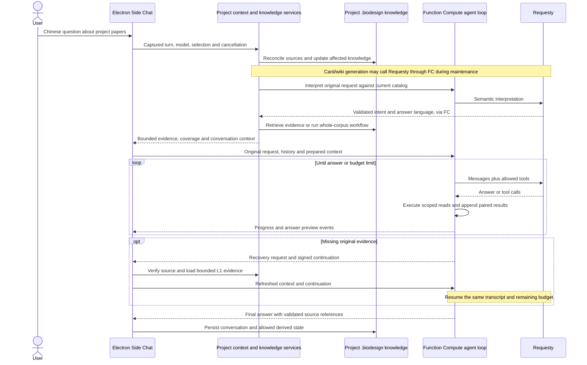

# Nanobot flow in literature Side Chat

**Updated architecture:** [Side Chat direct agent loop](sidechat-direct-agent-loop.md) supersedes the mandatory semantic-preparation stages below. These notes preserve the original comparison and earlier integration history.

Inspected the local Nanobot checkout at `2fb16593` on 2026-09-19. Integration branch: `nanobot/sidechat`. This first integration concerns literature questions; it preserves the existing knowledge representations and Agent Work behavior.

## What Nanobot actually does

The WebSocket carries messages and progress. The agent loop itself does not depend on a WebUI or WebSocket implementation.

| Stage | Nanobot implementation | Behavior |
| --- | --- | --- |
| Receive | `nanobot/webui/src/lib/nanobot-client.ts`, `nanobot/nanobot/channels/websocket/runtime.py`, `nanobot/nanobot/channels/base.py` | The client sends content, chat ID, optional turn ID, attachments and workspace scope. The channel validates the input and publishes an `InboundMessage`. |
| Route | `nanobot/nanobot/bus/events.py`, `nanobot/nanobot/bus/queue.py`, `nanobot/nanobot/agent/loop.py` | Channel/chat identity selects a session. The loop restores it, handles compaction and commands, builds the turn, runs it, persists it, and prepares an outbound reply. |
| Build context | `nanobot/nanobot/agent/context.py` | A system message combines identity, applicable `AGENTS.md`/`SOUL.md`/`USER.md`, tool instructions, memory, active skills, skill summaries and any archived conversation summary. History follows. The fresh user message remains a separate transcript input, with attachments and runtime context. |
| Request model | `nanobot/nanobot/agent/runner.py` | The context governor bounds the request. The selected provider receives messages and tool definitions through `chat_stream_with_retry`. |
| Execute tools | Same runner and `nanobot/nanobot/agent/tools/execution.py` | Append the assistant tool-call message, execute permitted tools, append one tool result per call ID, checkpoint, and request the model again. Tool batches can share a model round. |
| Finish | Runner, loop, session manager, channel delivery | A usable answer ends the ordinary loop. Limits and errors have explicit recovery/finalization paths. Session history is persisted separately from transport events. |
| Deliver | WebSocket runtime and turn delivery hooks | Progress/tool activity, text deltas, stream endings and final replies are distinct events. Chat/turn/stream IDs associate updates with the right conversation. A stream can end with `resuming` when tools will run next. |

Nanobot does **not** automatically put every project file into the prompt. The model discovers and reads evidence through tools. Its general filesystem and shell tools are substantially broader than Side Chat needs, and should not be imported into this surface.

### Chinese questions and English sources

The inspected text path retains the original Unicode question, source text and tool results. WebSocket and session serialization use Unicode-preserving JSON. There is no mandatory Chinese-to-English translation call followed by a mandatory English-to-Chinese translation call in the core loop. The model can read English evidence and produce Chinese directly, with preferences supplied by the user/profile/context. This is a capability of the selected model, not a guarantee provided by the socket transport. A user can still explicitly request a translation as a task.

For our app, language is more explicit: `shared/semantic-intent.js` retains `originalQuery`, `inputLanguage`, `answerLanguage` and `canonicalQueryEn`. The existing semantic interpretation can provide an English scientific goal. When that goal is unsuitable, bounded concept/identifier forms are used. Retrieval retains the original query alongside the English form and checks preservation of identifiers such as `EctD`, `A163V`, DOI and units. The final answer follows the question's language or the user's explicit override. The interface language and the papers' language do not independently select the answer language. No extra translation stage is needed.

### How many model calls?

For an ordinary Nanobot turn, if there are `R` model responses requesting tool execution followed by one answer, the loop makes `R + 1` logical model calls. For example, list files → read papers → answer is three calls; reading several papers in the same tool batch does not itself add one call per paper. A tool that invokes another model can add calls independently.

The inspected default `max_tool_iterations` is 200. This is an iteration limit, not a promise to make 200 requests and not an appropriate default to copy to a metered Side Chat. Provider retries, compaction, recovery and finalization can add requests beyond the ordinary `R + 1` case. There is no fixed Nanobot call count for “summarize all papers”: it depends on the model's tool choices, document size, context and cached session state.

## Electron adaptation

The application already has the required transport and a compatible tool loop. Keep Electron's confined preload/IPC bridge for local operations and authenticated HTTP/SSE for Function Compute. Requesty credentials stay in Function Compute.

The actual final stage can resume after the recovery handoff; it must not start another preparation/corpus workflow. Key app locations:

- [`project-context-service.js`](project-context-service.js): host context, conversation scope, preparation gate, evidence selection and one bounded evidence-recovery cycle.
- [`request-pipeline.js`](request-pipeline.js): shared, incremental knowledge synchronization with per-source readiness and failures.
- [`source-system.js`](source-system.js): source versions, original evidence, canonical Paper Cards, corpus snapshots, result handles, verification and invalidation.
- [`side-chat-agent.js`](../alibaba-fc/side-chat-agent.js): prompt assembly, effect authorization, model/tool loop, compaction and call accounting.
- [`index.js`](../alibaba-fc/index.js), [`requesty-stream.js`](../alibaba-fc/requesty-stream.js), [`event-stream.js`](../shared/event-stream.js): provider adapter, UTF-8 stream decoding and app events.
- [`app.js`](app.js): captured turn identity, progress/preview rendering, continuation exchange and final conversation persistence.

App SSE events include `status`, `delta`, `reset`, `sources`, `evidence-recovery`, `complete` and `error`. A delta is a preview; only the final completion becomes the persisted answer. Tool arguments and provider reasoning remain outside visible answer text. UTF-8 decoding handles Chinese characters split across network chunks. Existing cancellation and project/conversation checks prevent a late result from being committed into another conversation. This gives the useful Nanobot delivery behavior without introducing its Python gateway or WebSocket framework.

## Knowledge and write boundaries

The five existing layers are **L0 through L4**, as defined in [`QMD_KNOWLEDGE_ARCHITECTURE.md`](QMD_KNOWLEDGE_ARCHITECTURE.md):

| Layer | Role in Side Chat |
| --- | --- |
| L0: original files | Authoritative user PDFs and other sources. Side Chat does not edit, overwrite, delete or download source files. |
| L1: extracted evidence | Versioned, page-preserving text and evidence handles. Exact scientific claims return here for support. |
| L2: Paper Cards | Reusable structured paper summaries and routing hints. Preserve their source hash and generation contract. |
| L3: topics/wiki | Cross-paper organization and derived interpretations. Refresh affected material through the existing maintenance services. |
| L4: syntheses | Saved corpus results with snapshot, coverage, verification and version history. Membership/content changes stale prior current conclusions; explicit synthesis/update requests produce current results. |

Allowed writes remain project-managed state under `.biodesign/`: knowledge artifacts, indexes, jobs, workflow journals, result handles, memory and conversation records. Side Chat cannot commit the Agent Work recommendation, execute arbitrary shell commands or mutate source files. The model's proposed tool name cannot grant a missing permission; the backend and host boundaries remain authoritative.

Each new Side Chat turn now reconciles and synchronizes knowledge **before semantic interpretation or evidence retrieval**, including a question later classified as `web` or `none`. Only changed, missing or failed derived artifacts need work. An unchanged library takes the existing metadata-only path. Maintenance does not force unrelated paper evidence into a non-project answer.

Deleted/changed sources invalidate dependent active knowledge. A failed PDF remains a reported coverage gap; unrelated ready papers can still be used. A failed whole preflight or cancellation stops the answer path. Refresh happens at the turn boundary, with existing source-version checks during evidence use; this change does not add a continuous filesystem watcher or eagerly regenerate every saved synthesis.

## “帮我总结文件夹里的所有论文”

1. Synchronize added, modified and deleted project sources. Build semantic context from the resulting catalog, retaining the Chinese request and selected model.
2. Resolve the paper set: a hard user selection if present, otherwise all eligible project papers. Include preparation failures in coverage rather than silently reducing the task to top-K hits.
3. Use the existing corpus workflow. Reuse compatible canonical Paper Cards and valid maps; make query-specific local projections where supported. Missing requested facts can require current L1 evidence. Fall back to scoped retrieval/model mapping when required.
4. Group/reduce and verify through the existing workflow, retaining original paper/page references and explicit gaps. L3/L4 are derived interpretations, not independent scientific evidence.
5. Give the answer loop a bounded result/coverage bundle and available evidence handles. It can inspect those further, then answer in Chinese with citations and the actual analyzed/failed counts.

### Requesty accounting for our app

Count logical provider work separately from HTTP requests and local tool calls:

`total = knowledge maintenance + semantic interpretation + retrieval/mapping + answer-loop calls + provider retries`

| Component | Expected behavior |
| --- | --- |
| Metadata scan, hashing, parsing, lexical search, local projection/reduction | No Requesty model call. |
| L2 preparation | Warm compatible card: zero. Successful native-PDF or combined-text generation: normally one per cold/changed paper. Oversized text fallback can need one call per chunk plus synthesis; failures/retries add work. |
| L3 maintenance | Additional wiki generation calls when needed; retain existing cache and compatibility checks. |
| Semantic interpretation | One logical interpretation per normal Side Chat turn. It also supplies the language/English working-query information. |
| Retrieval/map fallback | Optional planner, reranker and per-paper mapper calls. Shared corpus planning is reused; these are not obligatory when canonical artifacts suffice. Configuration endpoints are HTTP requests, not model calls. |
| Answer loop | Normally `R + 1`. Eight bounded model rounds, at most 24 tool calls, and one no-tools finalization after exhaustion. One context-length retry can add another request. Local tool execution itself is free of Requesty calls. |
| Local evidence recovery | One host cycle. Current project-bound Side Chat resumes the same transcript, call counter and remaining budget using the existing signed continuation. |

Example under explicit assumptions: 32 compatible cached cards, no wiki regeneration, no retrieval fallback, no retries and a direct answer require **two logical model calls**: one semantic interpretation and one answer. If all 32 cards must instead be created with one successful native-PDF call each, that becomes **34**, plus any wiki generation or additional answer rounds. A list/read/answer loop uses three answer calls instead of one. These are scenarios, not measured guarantees for arbitrary user PDFs.

Use `preflightTelemetry` for L2/L3 work and source changes, `LiteratureApiClient.getTurnCallCounts` for role-specific preparation/retrieval requests, and `semanticTelemetry.cloudCalls.answer` for answer rounds. Shared preflight uses a maintenance run ID, so the initiating turn's client counter alone is not the full bill. Configuration calls and actual provider retry attempts must also be distinguished. The older README example counting 32 reranks and 32 maps describes a fallback fixture, not the current default canonical-card route.

## Implemented and verified in this pass

- Side Chat knowledge synchronization now precedes model interpretation regardless of retrieval scope. Agent Work retains its current scope-first policy.
- Project-bound local-only evidence recovery now carries the existing signed continuation, preserving tool-result pairing, provider call context, call counts and remaining round/tool budgets.
- Regression coverage checks changed/deleted sources, zero-evidence requests, source-file protection, partial failures, cancellation, selected-model propagation, Chinese replies over English evidence, and the recovery budget. Existing corpus, five-layer knowledge, citation and UTF-8/HTTP streaming tests remain in place.

Validation: all 779 Function Compute tests and 25 desktop chat/adapter tests pass; desktop preparation/renderer build and both syntax-check commands pass. Provider tests use deterministic fixtures; they establish orchestration and boundary behavior, not live Requesty answer quality. No production deployment, source-PDF modification, new experiment workflow or new Agent Work capability is part of this change.
